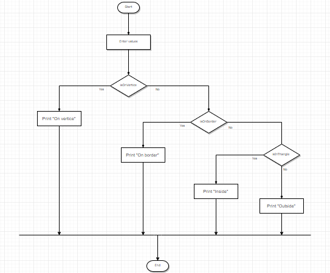
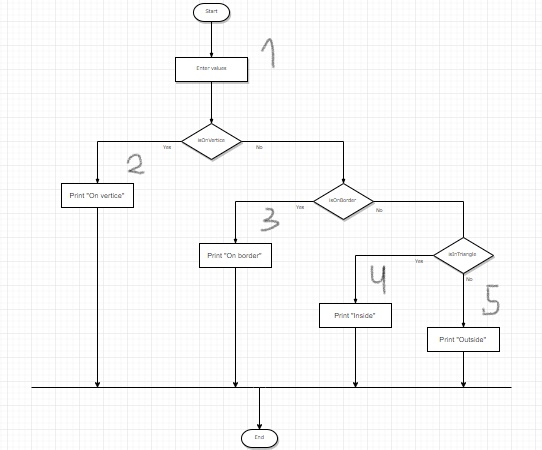

<div align="center">
    
</div>
<div align="center"> 
    <font size = 6>
    <p> Faculty of Computers, Informatics and </p> 
    <p>Microelectronics </p> 
    <p> Technical University of Moldova</p>
    </font>
</div>

<div align="center">
    <br>
    <br>
    <br>
    <br>
    <font size = 5>
        <p>Software Testing</p>
        <p>Laboratory work #4</p>
    </font>
</div>

<div align = "left">
    <br>
    <br>
    <br>
    <font size = 3>
        <p> Author: </p>
        <p> Ganusceac Vlad </p>
        <br>
        <p> Supervisor: </p>
        <p> Catruc Mariana </p>
    </font>
</div>

<div align = "center">
    <br>
    <br>
    <br>
    <p> 2019 </p>
    <p> Chişinau </p>
</div>

<P style="page-break-before: always">

# White-Box testing

*Steps for verification*:

* Use opens the application;
* He/she introduces coordinates of the triangle and a point;
* The application returns the message about position of the point relative the initial triangle, i.e. does it lie exactly inside it, on the border, on vertice or is it outside.

### Flow graph



From this flow graph it is clear that the first instruction is reading (initializing data) and it will be executed always. This instruction will have node #1.

In case if the decision operator is true, the next one instruction will be executed #2. And so on... See the picture below:



In order to check all the instructions we need 4 test cases, because they will traverse the following routes:

* { 1, 2 };
* { 1, 3 };
* { 1, 4 };
* { 1, 5 };

There is no route which is completely in another one. This means that the number of tests is irreduceble.

In this context we have also the minimum number of tests for checking all the routes. But in order to have the minimum number of tests for decisions, we need to keep the test where the decision will traverse through 1 -> 5 nodes: { 1, 5 }.

The oriented graph:
```
1 -> 2
1 -> 3
1 -> 4
1 -> 5
2 -> 6
3 -> 6
4 -> 6
5 -> 6
```

Thus I have _**N**_ = 6 (nodes) and _**E**_ = 8.

And the McCabe cyclomatic number in this case is equal to _**E - N + 2 = 8 - 6 + 2 = 4**_.

<P style="page-break-before: always">

## Code

_**Coordinate.cs**_

```c#
using System;
using System.Collections.Generic;
using System.Linq;
using System.Text;
using System.Threading.Tasks;

namespace PointAndTriangle
{
    class Coordinate
    {
        #region fields
        private int x;

        private int y;
        #endregion

        #region properties
        public int X
        {
            get
            {
                return this.x;
            }

            set
            {
                this.x = X;
            }
        }

        public int Y
        {
            get
            {
                return this.y;
            }

            set
            {
                this.y = Y;
            }
        }
        #endregion

        public Coordinate(int x, int y)
        {
            this.x = x;

            this.y = y;
        }

        public static bool operator ==(Coordinate coord1, Coordinate coord2)
        {
            return (coord1.X == coord2.X && coord2.Y == coord2.Y);
        }

        public static bool operator !=(Coordinate coord1, Coordinate coord2)
        {
            return !(coord1 == coord2);
        }
    }
}
```

<P style="page-break-before: always">

_**Triangle.cs**_

```c#
using System;
using System.Collections.Generic;
using System.Linq;
using System.Text;
using System.Threading.Tasks;

namespace PointAndTriangle
{
    class Triangle
    {
        #region fields
        private Coordinate coordA;

        private Coordinate coordB;

        private Coordinate coordC;
        #endregion

        #region properties
        public Coordinate A
        {
            get
            {
                return this.coordA;
            }

            set
            {
                this.coordA = A;
            }
        }

        public Coordinate B
        {
            get
            {
                return this.coordB;
            }

            set
            {
                this.coordB = B;
            }
        }

        public Coordinate C
        {
            get
            {
                return this.coordC;
            }

            set
            {
                this.coordC = C;
            }
        }
        #endregion

        #region Methods
        private int DoubleArea(Coordinate A, Coordinate B, Coordinate C)
        {
            return Math.Abs(((A.X * B.Y * 1 + B.X * C.Y * 1 + A.Y * 1 * C.X) -
                (C.X * B.Y * 1 + B.X * A.Y * 1 + C.Y * 1 * A.X)));
        }

        private bool OnSegment(Coordinate point, Coordinate left, Coordinate right)
        {
            return (Math.Abs((right.Y - left.Y) * (point.X - right.X)) == Math.Abs((point.Y - right.Y) * (right.X - left.X)) &&
                Math.Min(left.X, right.X) <= point.X && point.X <= Math.Max(left.X, right.X) &&
                Math.Min(left.Y, right.Y) <= point.Y && point.Y <= Math.Max(left.Y, right.Y));
        }

        public bool InTriangle(Coordinate point)
        {
            return (DoubleArea(point, A, B) + DoubleArea(point, A, C) + DoubleArea(point, B, C) == DoubleArea(A, B, C));
        }
        
        public bool OnBorder(Coordinate point)
        {
            return (OnSegment(point, A, B) || OnSegment(point, A, C) || OnSegment(point, B, C));
        }

        public bool OnVertice(Coordinate point)
        {
            return (point == A || point == B || point == C);
        }

        public Triangle(Coordinate A, Coordinate B, Coordinate C)
        {
            this.coordA = A;

            this.coordB = B;

            this.coordC = C;
        }
        #endregion
    }
}

```

<P style="page-break-before: always">

_**Program.cs**_

```c#
using System;
using System.Collections.Generic;
using System.Linq;
using System.Text;
using System.Threading.Tasks;

namespace PointAndTriangle
{

    class Program
    {
        static void Main(string[] args)
        {
            List<Triangle> triangles = new List<Triangle>()
            {
                new Triangle(new Coordinate(0, 0),
                new Coordinate(5, 5),
                new Coordinate(5, 0)),

                new Triangle(new Coordinate(0, 0),
                new Coordinate(3, 5),
                new Coordinate(5, 2)),

                new Triangle(new Coordinate(0, 0),
                new Coordinate(6, 10),
                new Coordinate(-2, 7)),

                new Triangle(new Coordinate(-10, -7),
                new Coordinate(-12, 30),
                new Coordinate(9, 0))
            };
            
            foreach(var item in triangles)
            {
                Coordinate coordinate = new Coordinate(3, 5);

                if (item.OnVertice(coordinate))
                {
                    Console.WriteLine("On vertice");
                }
                else if (item.OnBorder(coordinate))
                {
                    Console.WriteLine("On boarder");
                }
                else if (item.InTriangle(coordinate))
                {
                    Console.WriteLine("Inside");
                }
                else Console.WriteLine("Outside");
            }

            Console.Read();
        }
    }
}
```

<P style="page-break-before: always">

## Tests

All of them are just inside the program:

| Test no.  | Input  | Output  |
|---|---|---|---|---|
|  1 | Triangle: {{0, 0}, {5, 5}, {5, 0}}; Point: {3, 5}; | Outside |
|  2 | Triangle: {{0, 0}, {3, 5}, {5, 2}}; Point: {3, 5}; | On vertice |
|  3 | Triangle: {{0, 0}, {6, 10}, {-2, 7}}; Point: {3, 5};  | On boarder |
|  4 | Triangle: {{-10, -7}, {-12, 30}, {9, 0}}; Point: {3, 5}; | Inside |


<P style="page-break-before: always">

# Conclusion

During this laboratory work we have established differed White-box techniques, their usage and how exactly calculate the minimum number of tests which will be enough to verify whole functionality of the application (taking into considerations such aspects as covering all decisions, branches, instructions etc).

As an example I have chosed the program which verifys the relative position of the point and triangle. As the result, the point may be situated exactly on one of the triangle's vertices or to lie on the border, to be inside of the triangle's area or to be outside.

